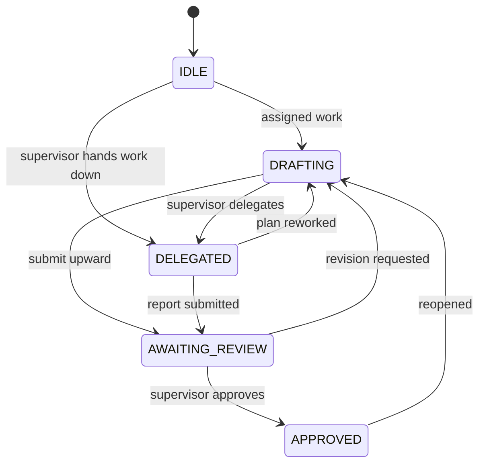

# 04 — Agent Lifecycle

Each agent has one lifecycle status. Valid changes are centralized in the domain state machine.



## Status meanings

| Status | Meaning |
|---|---|
| `IDLE` | No active delegated/drafting workflow |
| `DRAFTING` | Agent is working on its plan |
| `DELEGATED` | Supervisor has delegated work downward |
| `AWAITING_REVIEW` | Agent submitted work to its supervisor |
| `APPROVED` | Supervisor approved and merged the submitted work |

## Invalid approval paths

These transitions are intentionally absent:

```text
IDLE      → APPROVED
DELEGATED → APPROVED
```

An agent must reach `AWAITING_REVIEW` before it can be approved.

A transition to the current status is treated as a no-op, which helps make retried requests idempotent.

Other invalid transitions raise a state-machine error and are surfaced as an HTTP 400.

## API triggers

| Operation | Lifecycle effect |
|---|---|
| `POST /architecture/draft` | agent → `DRAFTING` |
| `POST /architecture/delegate` | supervisor → `DELEGATED`; direct reports → `DRAFTING` |
| `POST /architecture/submit` | subordinate → `AWAITING_REVIEW` |
| `POST /architecture/approve` | subordinate → `APPROVED` |
| `POST /architecture/request-revision` | subordinate → `DRAFTING` |

The relevant plan documents are updated as part of these operations.

## Review queue rules

Approval and revision require an actual pending submission.

Therefore:

- approving without a submission is rejected;
- requesting revision without a submission is rejected;
- approving the same submission twice cannot silently create a second merge.

## Capability is positional

There is no special supervisor class.

Instead:

```text
children_ids != empty → can delegate
parent_id != None      → can submit
```

Therefore:

- the root cannot submit upward;
- a leaf cannot delegate;
- changing a role title does not change permissions.

## Project publication

Publication is an aggregate-level operation.

A project cannot be published while required descendant work remains unapproved. The backend rejects premature publication rather than relying only on UI state.

## Restart behavior

Lifecycle status is serialized with the project.

On load, persisted values are normalized through `AgentStatus.coerce()`.

This keeps status stable across backend restarts and protects against case differences in persisted data.
