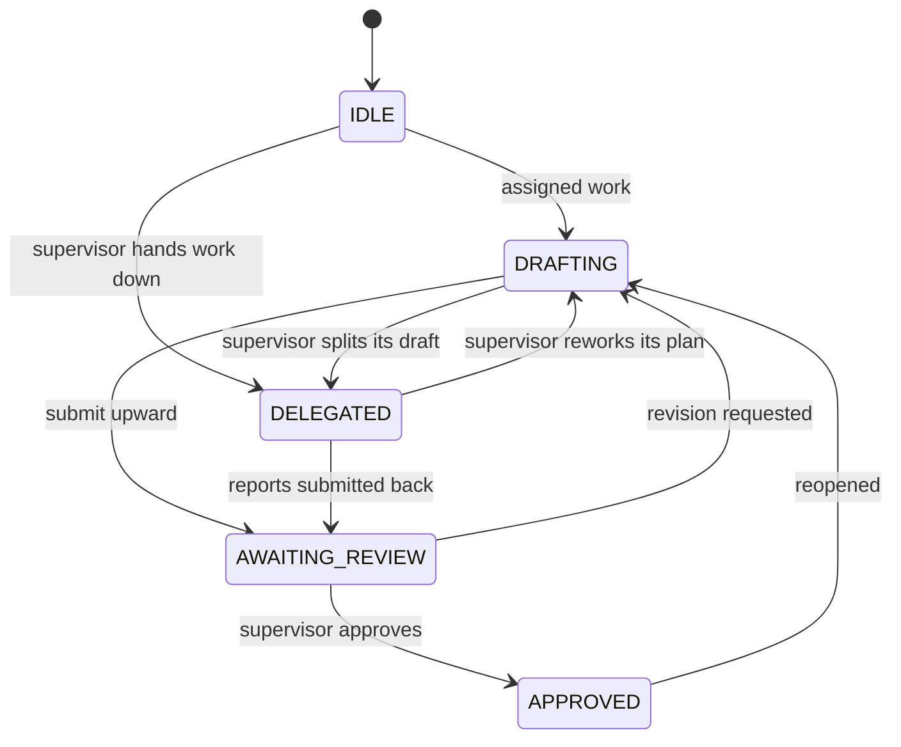

# 04 — Agent lifecycle

Every agent has exactly one status, and only the transitions in
`core/domain/state_machine.py` can change it.

## The two transitions that are deliberately absent

`IDLE → APPROVED` and `DELEGATED → APPROVED` were both reachable in v1. They
are not in the matrix, so nothing can reach `APPROVED` without having passed
through `AWAITING_REVIEW` — work cannot be approved that was never submitted.

A transition to the status an agent already has is a no-op rather than an
error, which keeps retried requests idempotent. Anything else raises
`InvalidStateTransitionError`, surfaced as HTTP 400.

## Who drives each transition

| Trigger | Effect |
|---|---|
| `POST .../architecture/draft` | agent → `DRAFTING` |
| `POST .../architecture/delegate` | supervisor → `DELEGATED`, every direct report → `DRAFTING` |
| `POST .../architecture/submit` | subordinate → `AWAITING_REVIEW` |
| `POST .../architecture/approve` | subordinate → `APPROVED`, its slice finalized and merged into the parent |
| `POST .../architecture/request-revision` | subordinate → `DRAFTING`, pending approval cleared |

Each of `draft`, `delegate`, `submit` and `approve` also writes its output into
the relevant agent's `plan` document slot, which is what the project-wide build
plan (`GET .../architecture/blueprint`) is assembled from.

Publishing is a separate, aggregate step. The blueprint is final only once every
report is `APPROVED` and the root holds a plan of its own; `blueprint/publish`
returns `409` before that, so an unfinished plan cannot be published.

`approve` and `request-revision` both require a submission actually sitting in
the supervisor's queue; without one they are rejected with 400, so approving
twice cannot silently re-merge.

`APPROVED` is not a dead end. The supervisor can send the work back with
`request-revision`, and re-drafting reopens the agent — both land it in
`DRAFTING`, from where it can submit again.

Delegation is atomic across the supervisor and its reports:
`AgentStateMachine.on_delegate()` moves all of them, so the tree cannot end up
with a supervisor marked delegated over reports still sitting idle.

## Capability is positional, not nominal

Nothing keys off a role's title. `agents/core/` checks the tree instead:

- `is_supervisor` — `children_ids` is non-empty ⇒ may delegate.
- `is_subordinate` — `parent_id` is set ⇒ may submit upward.

So the root cannot submit (`NotASubordinateError`), a leaf cannot delegate
(`NotASupervisorError`), and renaming an agent from "Specialist" to "Lead"
changes nothing until you actually give it reports.

## Statuses survive restarts

Status is serialized with the project and coerced back through
`AgentStatus.coerce()` on load, which accepts either case. In v1 the value was
written uppercase and compared lowercase, so every agent silently reverted to
idle on reload; `tests/unit/test_repository.py` pins the round-trip.
