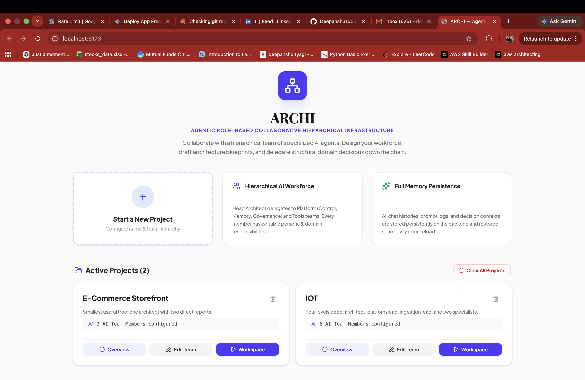
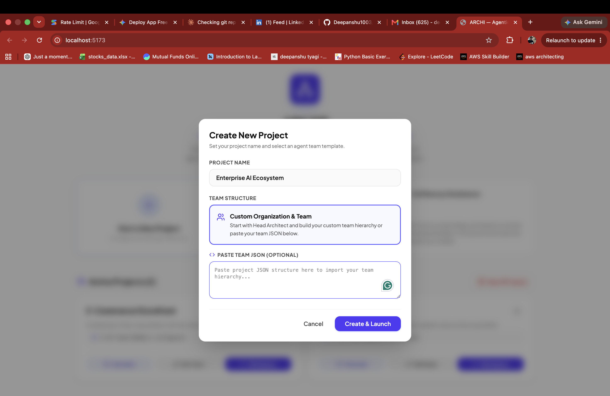
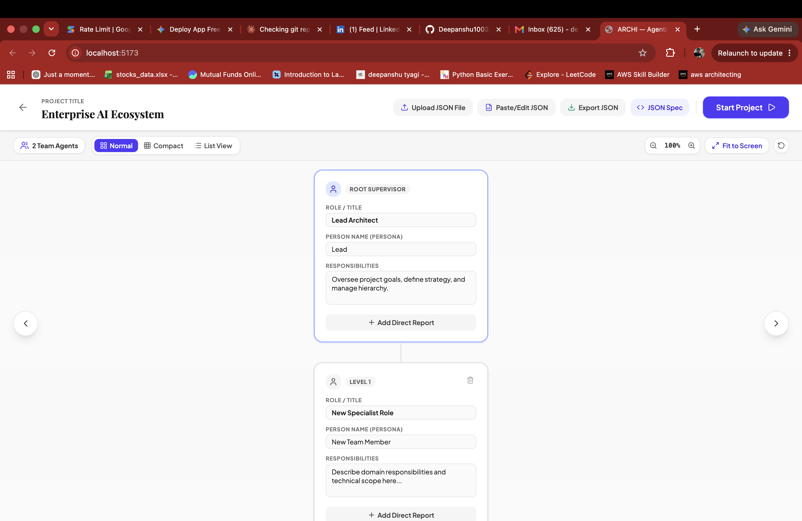
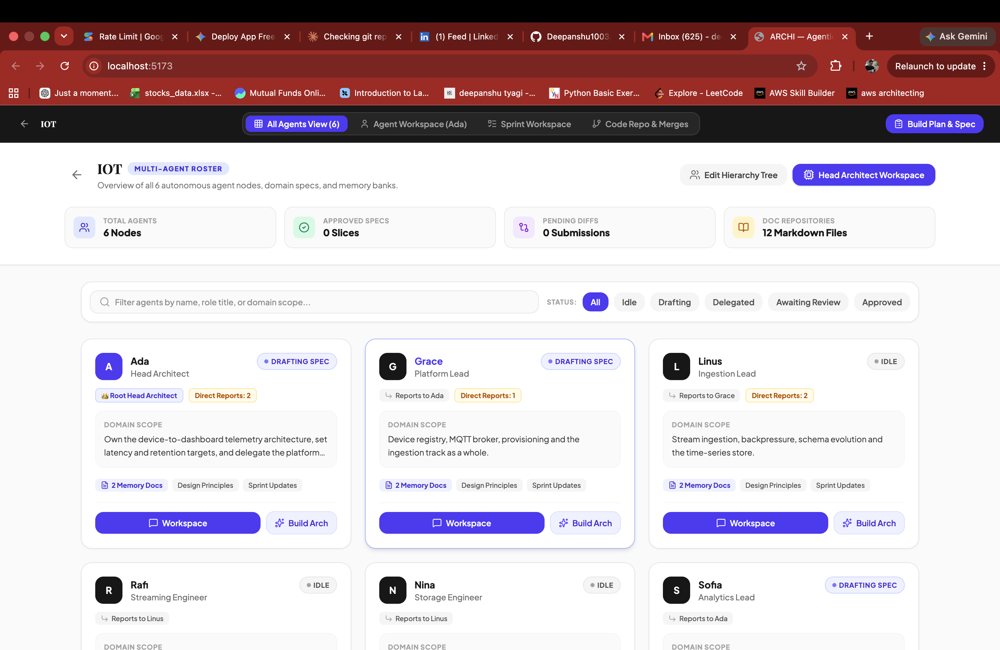
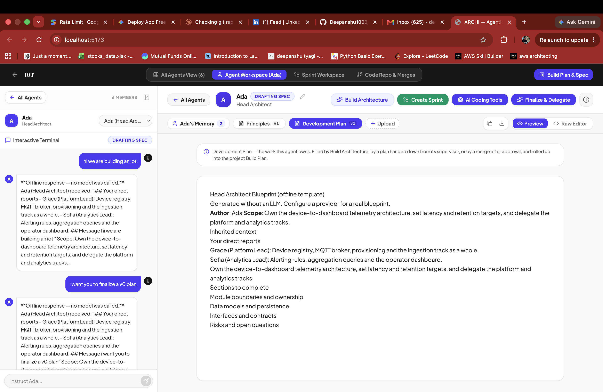

# ARCHI — UI Walkthrough

> **ARCHI (Agentic Role-Based Collaborative Hierarchical Infrastructure)**  
> A hierarchical AI-agent workspace for turning a high-level project idea into a structured architecture through delegation, refinement, review, and merge.

This document explains the end-to-end ARCHI workflow from the UI screenshots.

## 1. Home — Start a project

The ARCHI home screen is the entry point for creating and managing projects.

The main idea is simple: instead of treating AI as one general-purpose assistant, ARCHI organizes AI agents into a **hierarchical engineering team**.

The home screen highlights:

- Hierarchical AI workforce
- Project-level architecture workflows
- Persistent agent memory
- Existing projects
- Project overview, team editing, and workspace actions



### What happens here?

A user can:

1. Start a new project.
2. Open an existing project.
3. Review the current project/team structure.
4. Move into team setup or the agent workspace.

---

## 2. Create a New Project

The **Create New Project** dialog is where a project is initialized.

The user provides:

- Project name
- Team structure
- Optional team JSON

ARCHI supports both a guided custom organization and importing an existing organization structure.



### Why this matters

The organization is not just UI metadata.

The hierarchy determines the capabilities of each agent:

```text
Agent with direct reports
        ↓
Can delegate work

Agent with a parent
        ↓
Can submit work upward
```

This means the **position of an agent in the hierarchy determines its authority**.

---

## 3. Define the AI Engineering Team

After creating the project, the Setup screen allows the user to construct the organization.

Each agent can have:

- Role / Title
- Person / Persona
- Responsibilities
- Direct reports

For example:

```text
Head Architect
├── Platform Lead
│   ├── Backend Specialist
│   └── Infrastructure Specialist
└── Analytics Lead
    └── Data Specialist
```



### The important design decision

ARCHI does not rely only on titles such as "Lead" or "Manager" to determine permissions.

Instead, capabilities are derived from the actual hierarchy.

That makes the workflow deterministic and easier to govern.

---

## 4. Enter the Agent Roster

Once the team is configured, the **All Agents** view provides a project-wide view of the workforce.

The screen shows:

- Agent status
- Role
- Domain scope
- Number of reports
- Agent workspace
- Architecture-building actions



This becomes the control center for understanding where each agent is in the architecture workflow.

Typical lifecycle states include:

```text
IDLE
  ↓
DRAFTING
  ↓
DELEGATED
  ↓
AWAITING_REVIEW
  ↓
APPROVED
```

The backend enforces these transitions rather than allowing the frontend to arbitrarily change status.

---

## 5. Open an Agent Workspace

Selecting an agent opens the **Agent Workspace**.

This is where the agent's actual architecture work happens.

The workspace combines:

- Interactive terminal
- Agent identity and role
- Agent memory
- Principles
- Development Plan
- Build Architecture
- Create Sprint
- AI Coding Tools
- Finalize & Delegate
- Preview / Raw Editor



### Agent memory

The workspace separates the agent's knowledge into structured documents.

ARCHI currently maintains two server-managed document slots:

| Document | Purpose |
|---|---|
| Principles | Constraints, inherited context, boundaries |
| Development Plan | Work owned by the agent |

This prevents important architecture information from existing only inside a chat transcript.

---

## 6. Build Architecture

The user can instruct an agent through the interactive terminal.

For example:

> "We are building an IoT platform."

The agent can then create an architecture blueprint based on:

- Its own responsibilities
- Its parent context
- Its direct reports
- Existing project information

The resulting plan is written into the agent's development plan.

### Example flow

```text
User request
    ↓
Agent context
    ↓
Architecture generation
    ↓
Development Plan
    ↓
Review / refinement
```

The screenshot also demonstrates ARCHI's **offline fallback mode** during local testing.

When an LLM provider is unavailable, the system can return deterministic fallback content and explicitly mark it as an offline/degraded response instead of pretending that a model generated it.

---

## 7. Finalize & Delegate

Once a supervisor has a sufficiently complete architecture, the **Finalize & Delegate** action divides the work among its direct reports.

For example:

```text
Head Architect
│
├── Platform Lead
│     └── Device registry, MQTT, provisioning
│
└── Analytics Lead
      └── Alerts, aggregation, operator dashboard
```

The Planner component generates one architecture slice per known direct report.

The system validates the generated agent IDs against the actual hierarchy.

If a model fails to produce a valid slice for one of the reports, ARCHI can generate deterministic fallback content for that report.

---

## 8. Child Agents Refine Their Assigned Slice

After delegation, each child agent receives its assigned architecture scope.

The child can:

1. Read its inherited context.
2. Refine the plan.
3. Add technical details.
4. Update its development plan.
5. Submit the result to its supervisor.

This creates a recursive architecture process:

```text
High-level architecture
        ↓
Supervisor
        ↓
Delegated architecture slices
        ↓
Child agents
        ↓
Further refinement
        ↓
Review
```

The same workflow can continue down the hierarchy.

---

## 9. Submit for Review

A subordinate agent cannot simply mark its own work as approved.

Instead:

```text
Child Agent
    ↓
Submit
    ↓
Supervisor Review
```

Before a submission becomes an approval request, ARCHI performs server-side governance checks.

Examples include:

- minimum/maximum content size;
- authority violations;
- invalid hierarchy assignments;
- structurally empty plans.

The goal is to make governance part of the architecture workflow rather than relying only on UI controls.

---

## 10. Supervisor Review & Merge

The supervisor receives the child's submission and can inspect the proposed change.

The review flow is:

```text
AWAITING_REVIEW
      │
      ├── Request Revision
      │        ↓
      │     DRAFTING
      │
      └── Approve
               ↓
           APPROVED
               ↓
        Merge into parent
```

ARCHI uses stable per-agent section markers during merging.

For example:

```html
<!-- archi:section agent=platform-lead -->
```

When the same agent is approved again, its previous section is replaced instead of duplicated.

This makes repeated review cycles much safer.

---

## 11. Build Plan & Specification

Once the hierarchy has completed its work, the project can be assembled into a larger project blueprint.

The final concept is:

```text
Root Architecture
      +
Approved Child Architecture
      +
Approved Grandchild Architecture
      ↓
Project Blueprint
```

The project-level specification is therefore assembled from explicitly delegated and reviewed work rather than simply concatenating arbitrary agent output.

---

# Complete ARCHI Flow

The complete UI and architecture workflow can be summarized as:

```text
┌──────────────────────┐
│      Home Screen     │
│  Create / Open       │
│       Project        │
└──────────┬───────────┘
           ↓
┌──────────────────────┐
│   Create New Project │
│ Name + Team / JSON   │
└──────────┬───────────┘
           ↓
┌──────────────────────┐
│    Team Structure    │
│ Roles + Personas +   │
│ Responsibilities     │
└──────────┬───────────┘
           ↓
┌──────────────────────┐
│     Agent Roster     │
│ Status + Domain +    │
│ Reports              │
└──────────┬───────────┘
           ↓
┌──────────────────────┐
│   Agent Workspace    │
│ Memory + Principles  │
│ + Development Plan   │
└──────────┬───────────┘
           ↓
┌──────────────────────┐
│  Build Architecture  │
│ Chat → Architecture  │
│ → Development Plan   │
└──────────┬───────────┘
           ↓
┌──────────────────────┐
│ Finalize & Delegate  │
│ Parent → Child       │
│ Architecture Slices  │
└──────────┬───────────┘
           ↓
┌──────────────────────┐
│  Child Refinement    │
│ Develop assigned     │
│ architecture slice   │
└──────────┬───────────┘
           ↓
┌──────────────────────┐
│       Submit         │
│   Governance Check   │
└──────────┬───────────┘
           ↓
┌──────────────────────┐
│ Supervisor Review    │
│ Diff → Revise /      │
│ Approve              │
└──────────┬───────────┘
           ↓
┌──────────────────────┐
│    Merge & Approve   │
│ Stable agent section │
└──────────┬───────────┘
           ↓
┌──────────────────────┐
│  Build Plan & Spec   │
│ Final project        │
│ architecture         │
└──────────────────────┘
```

# Architecture Behind the UI

The UI is backed by a layered FastAPI architecture:

```text
React + Vite
     │
     │ HTTP / JSON
     ▼
FastAPI
     │
     ├── Core Domain
     │     ├── Models
     │     ├── State Machine
     │     └── Ports
     │
     ├── Agent Services
     │     ├── Drafting
     │     ├── Delegation
     │     ├── Submission
     │     └── Merging
     │
     └── Adapters
           ├── Gemini
           ├── Offline LLM
           ├── Governance
           ├── Documents
           ├── Event Bus
           └── JSON Persistence
```

The separation means the UI does not directly control architecture state.

The backend remains authoritative for:

- agent lifecycle;
- hierarchy permissions;
- document validation;
- governance;
- delegation;
- approvals;
- merging;
- persistence.

# Project Goal

ARCHI is intended to explore a different way of building software with AI:

> **AI agents should behave less like isolated chatbots and more like members of a structured engineering organization.**

Instead of asking one model to produce an entire system in a single response, ARCHI introduces:

- hierarchy;
- ownership;
- delegation;
- memory;
- governance;
- review;
- approval;
- deterministic state transitions;
- composable architecture slices.

This creates a foundation for experimenting with **multi-agent software architecture workflows**.

---

## Repository

GitHub: https://github.com/Deepanshu1003/ARCHI/tree/archi-v2-optimized

> **Note:** The screenshots were captured during local development. The UI includes a few legacy/experimental workspace controls that are not part of the durable v2 backend workflow.
