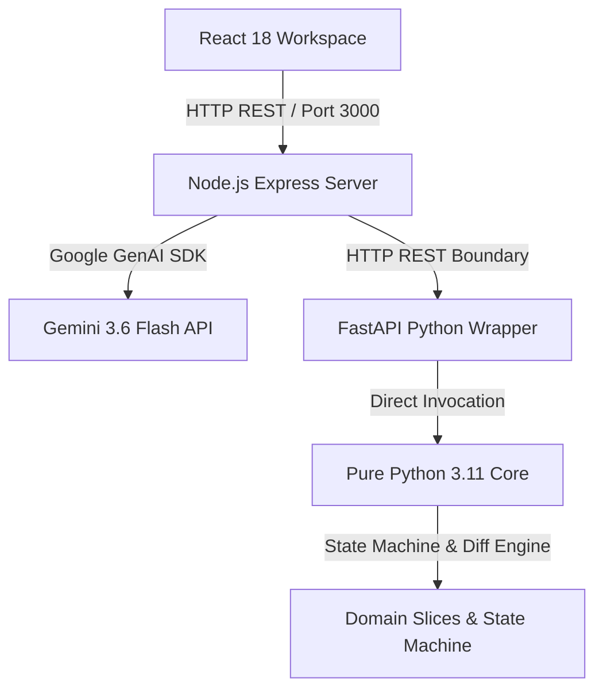

# 00 — System Overview & Architecture Rationale

## ARCHI: Agentic Role-based Collaborative Hierarchical Infrastructure

ARCHI is a multi-agent software engineering simulation platform designed to model, execute, and govern complex software engineering, architectural delegation, sprint planning, and code release workflows.

### The Two-Runtime Architecture

ARCHI enforces a strict separation between domain business logic and host environment integration via a two-runtime model:

1. **Pure Python Domain Core (`backend/core/`)**
   - Implemented in pure Python 3.11+ using standard library modules (`dataclasses`, `enum`, `typing`, `difflib`, `uuid`).
   - Contains zero third-party dependencies.
   - Houses domain models (`AgentRole`, `ArchitectureSlice`, `ProjectArchitecture`), the deterministic state machine (`AgentStateMachine`), and abstract ports (`AgentPort`, `DelegationPort`, `MemoryPort`, `GovernancePort`, `EventBusPort`).

2. **Node.js Express & Gemini Service Layer (`server.ts` / `backend_api/`)**
   - Manages HTTP REST request routing, JSON disk persistence (`/data/projects.json`), client-side static asset serving, and integration with external LLMs (Google GenAI SDK `gemini-3.6-flash`).
   - Exposed on port 3000 to comply with container ingress routing.

### Why Runtimes Are Connected Only Through Ports
- **Decoupling**: The Python domain core never imports Node/Express modules or hardcodes Gemini dependencies.
- **Testability**: Pure Python ports allow running fast unit and integration tests without network access or API key dependencies.
- **Resilience**: If an external LLM service experiences high demand (e.g. 503 errors), fallback generators attached to ports fulfill requests seamlessly.
