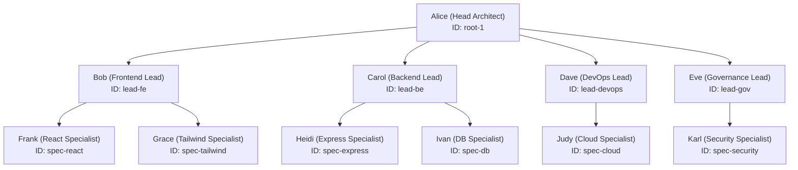

# 02 — Organizational Hierarchy & Agent Tree

## Hierarchical Workforce Structure

ARCHI organizes software engineering agents into strict supervisor and subordinate relationships.

### Delegation Protocol Rules
1. **Direct Report Scoping**: A supervisor delegates architectural sub-plans **strictly to direct reports** (`childrenIds`).
2. **Context Isolation**: Subordinate agents receive sliced instructions relevant to their specific domain rather than unfiltered system context.
3. **Upward Publishing**: Specialists publish completed domain slices upward to their immediate supervisor (`parentId`) for diff review.
