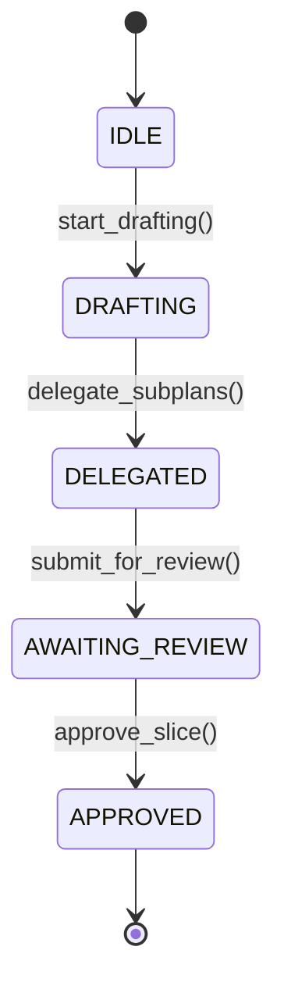

# 03 — Agent State Machine Lifecycle

## Deterministic Lifecycle Rules

Every agent in ARCHI transitions through an explicit, deterministic state machine implemented in `backend/core/domain/state_machine.py`.

### State Definitions
- `IDLE`: Initial unassigned state.
- `DRAFTING`: Agent is generating or refining its architectural plan.
- `DELEGATED`: Master plan is finalized and sub-plans are delegated to direct reports.
- `AWAITING_REVIEW`: Subordinate has published sub-plan upward; waiting for supervisor review.
- `APPROVED`: Supervisor has inspected textual diff and approved the slice.

### Invalid Transition Enforcement
Attempts to bypass states (e.g., `IDLE` -> `APPROVED` directly) raise a `ValueError("Invalid state transition...")`.
