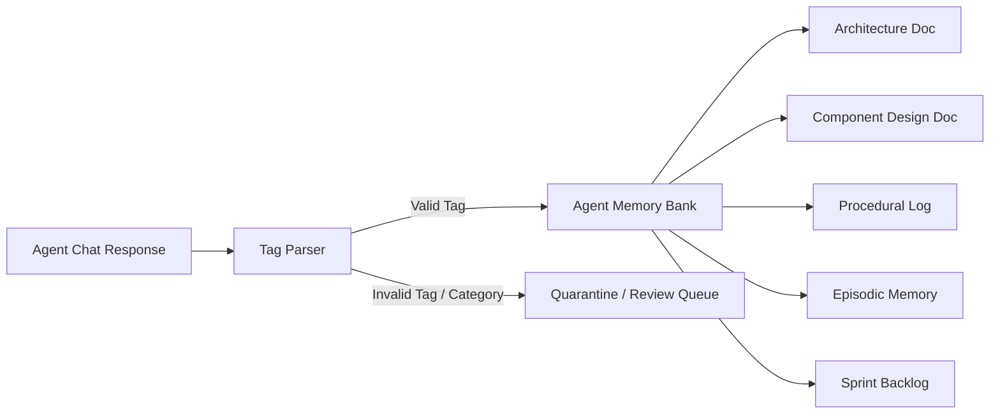

# 04 — Memory Banks & Role-Based Schema Governance

## Role-Driven Memory Schemas & Governance

Each agent possesses an isolated Memory Bank validated against role-based schemas (`src/utils/roleSchemas.ts` and Python domain models):

### Memory Tag Processing & Governance Rules
1. **`[DOC_CREATE: Title | docType]`** -> Creates a new memory document matching role schema requirements.
2. **`[DOC_UPDATE: Title]`** -> Updates document content with version history tracking (`versions[]`).
3. **`[DOC_DELETE: Title]`** -> Soft-deletes document (archives with confirmation via `isArchived`).
4. **Quarantine Gate**: Any tag failing role schema validation or pointing to an unrecognized document category is placed in quarantine for human supervisor review.
5. **Genesis Document Immutability**: The Origin Document (`00_origin_document.md`) created during Phase 0 genesis is strictly read-only and cannot be altered or deleted by agents or users.

