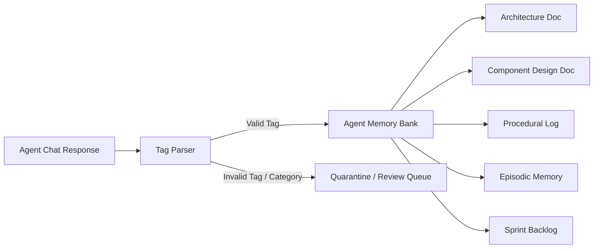

# 04 — Memory Banks & Role-Based Schema Governance

## Role-Driven Memory Schemas

Each agent possesses an isolated Memory Bank validated against role-based schemas:

### Memory Tag Processing
1. `[DOC_CREATE: Title | docType]` -> Creates new memory document matching role schema.
2. `[DOC_UPDATE: Title]` -> Updates document content.
3. `[DOC_DELETE: Title]` -> Soft-deletes document (archives with confirmation).
4. **Quarantine Gate**: Any tag failing role schema validation is placed in a quarantine state for human review rather than silently dropping or guessing content.
