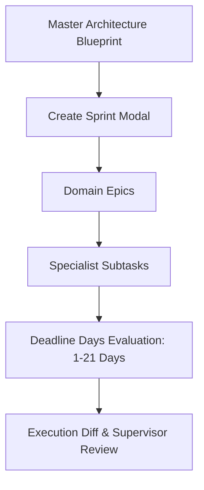

# 05 — Sprint Planning Workspace & Deadline Tracking

## Agile Sprint Workspace

The Sprint Planning Workspace converts architectural blueprints into Sprints composed of Epics and Subtasks.

### Deadline Days Metric
Instead of abstract story points, effort is estimated using **Deadline Days** (1, 2, 3, 5, 7, 10, 14, 21 Days).

### Features
- **Auto-Generate Sprints**: Head Architect auto-generates Epics across direct report leads.
- **Subtask Lifecycle**: Subtasks transition through `TODO` -> `IN_PROGRESS` -> `AWAITING_REVIEW` -> `DONE`.
- **Execution Diffs**: Subtasks include code diff previews for supervisor review prior to completion.
