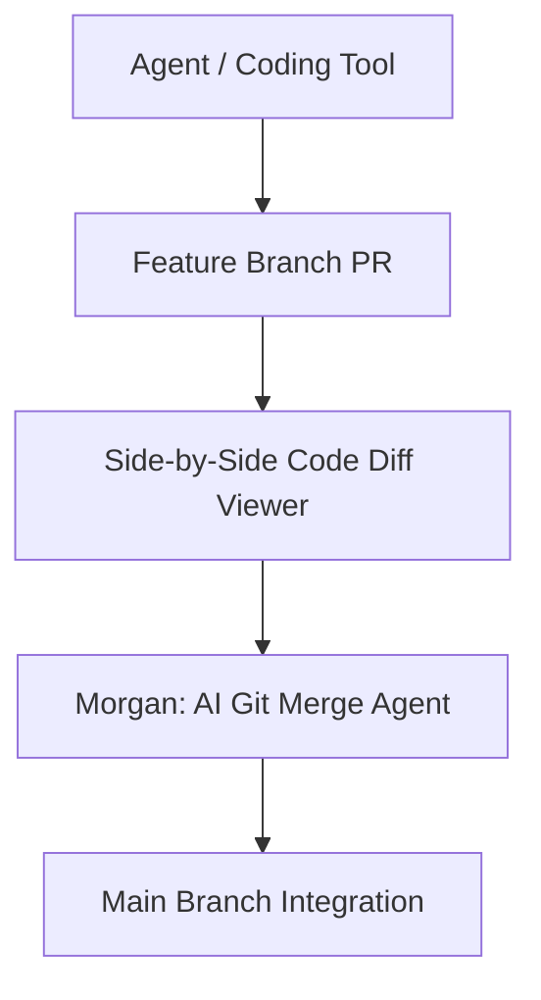

# 06 — Unified Code Repository & AI Git Merge Agent

## Central Revision Control & Release Agent

The Code Repository Workspace (`CodeRepositoryWorkspace`) acts as the project's central repository hosting code files, pull requests, and automated release workflows.

### Components
- **Main Branch Explorer**: File tree listing repository files (`src/App.tsx`, `server.ts`, etc.).
- **Pull Request Manager**: Displays active feature branch PRs created by agents.
- **Side-by-Side Code Diff Viewer**: Compares feature branch code line-by-line against `main`.
- **Morgan (AI Git Merge Agent)**: Dedicated AI release manager performing automated branch merges with execution logs.
